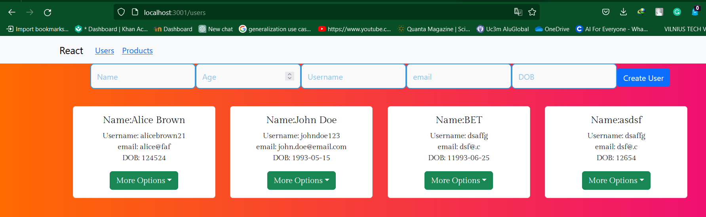

This assignment encompasses practical exercises aimed at acquainting oneself with MongoDB, Node.js, Express.js, and React, collectively forming the MERN stack.
This project showcases the integration of MongoDB and React, featuring functionalities such as creating collections, adding fields, utilizing React-Bootstrap components, implementing React Router, and integrating Express methods for CRUD operations.

## Create Additional MongoDB Collection:
Added a new MongoDB collection to store supplementary data, displayed alongside user data with input fields for data entry.

## Extend User Collection:
Expanded the user collection by including new fields like email and birth date, providing input fields for data entry using React-Bootstrap.

## Utilize React-Bootstrap Components:
Incorporated two new React-Bootstrap components to enhance the UI and functionality.

## Implement React Router:
Utilized React Router for seamless navigation, enabling users to view individual collections on separate pages.

## Update and Delete Information (Collection 1 & 2):
Implemented Express methods (PUT and DELETE) for updating and deleting information in both available collections, with dedicated buttons for actions.

## How to Run

To run the project locally:
Clone this repository.
Navigate to the project directory.
Install dependencies with npm install.
Start the development server with npm start.
Access the application at http://localhost:3000 in your browser.

# react.js_work
use npm i and npm start
run npm start first in server/ directory then at client/users/ 
